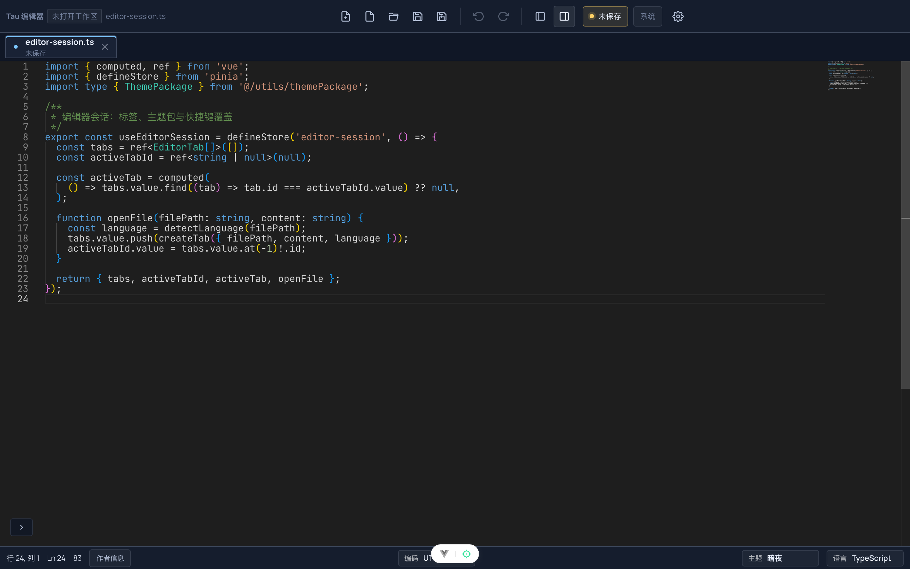
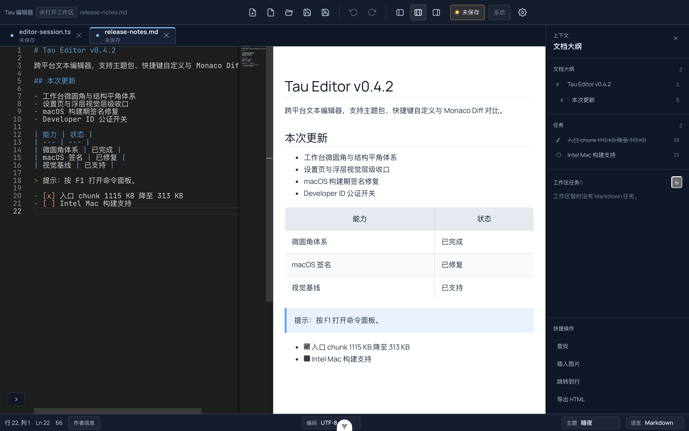
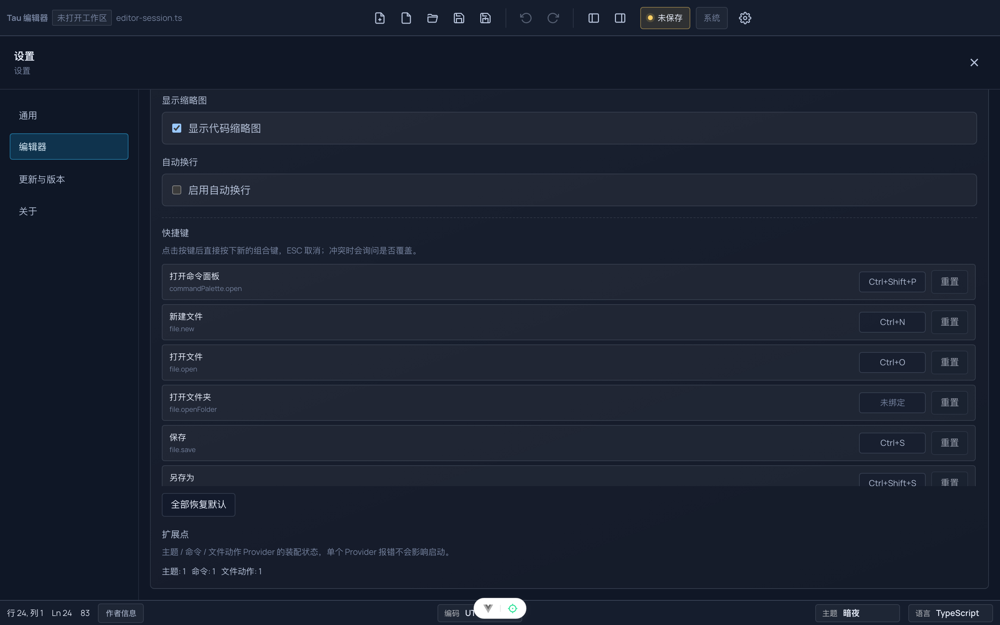
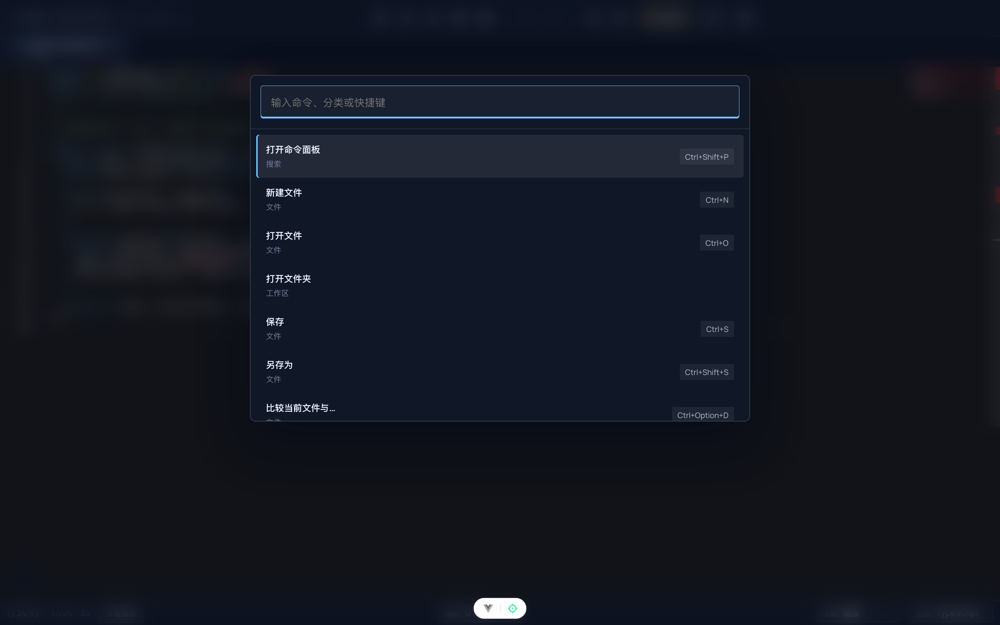

# Tau 编辑器（Tau Editor）

> 基于 Tauri 2 + Vue 3 的现代跨平台文本编辑器，支持 Windows / macOS / Linux


## 📸 界面预览

主界面：TypeScript 语法高亮、标签页、缩略图与状态栏。



命令面板与主题切换演示：


| Markdown 分栏预览与文档大纲 | 快捷键自定义与扩展点 |
| --- | --- |
|  |  |

命令面板（F1 或 `Ctrl+Shift+P`）：



> 截图由 `scripts/capture-readme-shots.mjs` 基于前端 Web 版本自动生成，可用 `node scripts/capture-readme-shots.mjs` 重新录制。


## ⬇️ 下载安装

最新版本：**[v0.4.2](https://github.com/kokotao/tau-editor/releases/tag/v0.4.2)**（全部安装包见 [Releases](https://github.com/kokotao/tau-editor/releases)）

| 平台 | 安装包 | 说明 |
|---|---|---|
| macOS (Apple Silicon) | `Tau.Editor_0.4.2_aarch64.dmg` | 首次打开需系统放行一次，见下方说明 |
| Windows (x64) | `Tau.Editor_0.4.2_x64-setup.exe` / `Tau.Editor_0.4.2_x64_zh-CN.msi` | 双击安装 |
| Linux (x64) | `Tau.Editor_0.4.2_amd64.deb` / `Tau.Editor-0.4.2-1.x86_64.rpm` / `Tau.Editor_0.4.2_amd64.AppImage` | AppImage 需先 `chmod +x` |

> **macOS 首次打开说明**：构建流程已在打包前对 `.app` 做 ad-hoc 签名（`bundle.macOS.signingIdentity = "-"`），
> 重新构建的安装包不会再触发「已损坏」类错误。由于尚未使用 Apple Developer ID 公证，首次打开仍需
> 在「系统设置 → 隐私与安全性」点击一次「仍要打开」（旧版 macOS 也可右键点击 App 选择「打开」）；
> 如需完全免提示，需配置 Developer ID 签名与公证。
>
> `v0.4.1` 及更早的安装包如仍提示「已损坏」，把 App 拖到「应用程序」后执行一次：
>
> ```bash
> xattr -cr "/Applications/Tau Editor.app"
> codesign --force --sign - "/Applications/Tau Editor.app"
> ```
>
> 完整说明见 [INSTALL.md](INSTALL.md#macos-安装步骤)。

## ✨ v0.4.2 更新亮点

- **微圆角体系**：统一采用 `0 / 2 / 4 / 6 / 8px`，结构保持平角，交互控件与浮层使用克制圆角
- **工作台视觉优化**：工具栏、标签、状态栏、设置页、菜单和 Markdown 预览统一视觉层级
- **macOS 签名修复**：构建期对整个 `.app` 执行 ad-hoc 签名，修复旧产物「已损坏」问题
- **Developer ID 开关**：CI 支持 Apple 证书与公证 Secrets，配置后可实现用户零提示打开
- **视觉回归基线**：继续覆盖编辑器、命令面板、设置页及双视口截图

完整变更记录见 [CHANGELOG.md](CHANGELOG.md)。

## 作者信息

- 作者：`albert_luo`
- 联系方式：`480199976@qq.com`
- GitHub：`https://github.com/kokotao/tau-editor`

## 公益捐赠

如果 Tau 编辑器帮助到了你，欢迎随缘支持。你的支持会用于持续维护和改进体验。

### 微信收款码


### 支付宝收款码


## 🚀 快速开始

### 环境要求

- **Node.js** >= 20.19（或 >= 22.12）
- **Rust** >= 1.77（通过 [rustup](https://rustup.rs) 安装）
- **pnpm** >= 9（CI 使用 pnpm 10）

### 安装依赖

```bash
# 安装 Rust (如果尚未安装)
curl --proto '=https' --tlsv1.2 -sSf https://sh.rustup.rs | sh

# 安装项目依赖
cd frontend
pnpm install

# 安装 Tauri CLI (如果尚未安装)
cargo install tauri-cli
```

### 开发模式

```bash
cd frontend
pnpm tauri dev
```

### 构建发布

#### Linux 系统依赖

在构建之前，需要安装以下系统依赖:

```bash
# Ubuntu/Debian
sudo apt-get update
sudo apt-get install -y libgtk-3-dev libwebkit2gtk-4.1-dev \
  libappindicator3-dev librsvg2-dev patchelf

# Fedora
sudo dnf install gtk3-devel webkit2gtk4.1-devel \
  libappindicator-gtk3-devel librsvg2-devel patchelf

# Arch Linux
sudo pacman -S webkit2gtk appindicator-gtk3 librsvg
```

#### 执行构建

```bash
cd frontend
pnpm tauri build
```

**本地构建产物位置:**
- Linux: `frontend/src-tauri/target/release/bundle/deb/` (.deb)
- Linux: `frontend/src-tauri/target/release/bundle/appimage/` (.AppImage)
- macOS: `frontend/src-tauri/target/release/bundle/dmg/` (.dmg)
- macOS: `frontend/src-tauri/target/release/bundle/macos/` (.app)
- Windows: `frontend/src-tauri/target/release/bundle/msi/` (.msi)
- Windows: `frontend/src-tauri/target/release/bundle/nsis/` (.exe)

**说明:** 上述目录只会在当前机器本地执行 `cd frontend && pnpm tauri build` 后出现。GitHub Actions 产物会出现在对应工作流的 `Artifacts` 区域，正式发布版本会挂到 GitHub `Releases` 页面。

#### 仅构建前端 (Web 版本)

如果只需要 Web 版本:

```bash
cd frontend
pnpm build
```

构建产物位于 `frontend/dist/`，可部署到任何静态文件服务器。

**注意:** 历史构建与阶段记录已整理到 [docs/status](docs/status/README.md)，Phase 10 构建状态见 [docs/status/PHASE10_BUILD_LOG.md](docs/status/PHASE10_BUILD_LOG.md)

### 安装指南

详细安装说明请查看 [安装指南](INSTALL.md)

- [Windows 安装步骤](INSTALL.md#windows-安装步骤)
- [macOS 安装步骤](INSTALL.md#macos-安装步骤)
- [Linux 安装步骤](INSTALL.md#linux-安装步骤)

## 📋 功能特性

### ✨ 核心功能

#### 📄 文件管理
- ✅ 新建、打开、保存、另存为
- ✅ 最近文件列表
- ✅ 文件编码自动检测（UTF-8、GBK 等）
- ✅ 大文件支持（优化中）

#### ✏️ 文本编辑
- ✅ 剪切、复制、粘贴
- ✅ 撤销/重做（无限层级）
- ✅ 多光标编辑
- ✅ 代码折叠
- ✅ 自动缩进

#### 🔍 搜索替换
- ✅ 快速查找（Ctrl+F）
- ✅ 正则表达式支持
- ✅ 批量替换
- ✅ 匹配项高亮

#### 🎨 语法高亮
- ✅ 50+ 编程语言支持
- ✅ 自动语言检测
- ✅ 主题适配

#### 🏷️ 多标签页
- ✅ 同时编辑多个文件
- ✅ 标签页切换
- ✅ 未保存提示
- ✅ 标签分组（计划中）
- ✅ 在新窗口打开 / 迁移标签（保留未保存内容，v0.4.0）

#### 🌙 主题系统
- ✅ 浅色主题
- ✅ 深色主题
- ✅ 快速切换
- ✅ 5 套内置皮肤 + 快速调色
- ✅ 主题包导入 / 导出，UI 与 Monaco 同步（v0.4.0）

#### 🔀 对比与扩展（v0.4.0）
- ✅ 只读 Monaco Diff，支持并排 / 内联切换
- ✅ 命令面板 / 文件树右键 / Git 变更三个对比入口
- ✅ 快捷键自定义：录制改键、冲突检测、单条 / 全部重置
- ✅ Provider 扩展点：主题 / 命令 / 文件动作注册表

#### 💾 自动保存
- ✅ 可配置保存间隔
- ✅ 崩溃恢复
- ✅ 会话恢复

### 📊 支持的文件格式

| 格式 | 支持级别 | 说明 |
|------|---------|------|
| `.txt` | ✅ 完整支持 | 纯文本文件 |
| `.md` | ✅ 语法高亮 | Markdown 文件 |
| `.json` | ✅ 语法高亮 | JSON 数据文件 |
| `.xml` | ✅ 语法高亮 | XML 文件 |
| `.yaml` | ✅ 语法高亮 | YAML 配置文件 |
| `.csv` | ✅ 语法高亮 | CSV 数据文件 |
| `.html` | ✅ 语法高亮 | HTML 文件 |
| `.js/.ts` | ✅ 完整支持 | JavaScript/TypeScript |
| `.py` | ✅ 完整支持 | Python |
| `.java` | ✅ 完整支持 | Java |
| `.cpp/.c` | ✅ 完整支持 | C/C++ |
| `.go` | ✅ 完整支持 | Go |
| `.rs` | ✅ 完整支持 | Rust |
| 更多... | ✅ 50+ 语言 | 查看完整列表 |

### 🛠️ 技术栈

| 层级 | 技术 | 版本 |
|------|------|------|
| 桌面框架 | Tauri | 2.10 |
| 后端语言 | Rust | 2021 edition |
| 前端框架 | Vue 3 | 3.5 |
| 语言 | TypeScript | 5.9 |
| 构建工具 | Vite | 7.3 |
| 状态管理 | Pinia | 3.0 |
| UI 组件 | Naive UI | 2.44 |
| 编辑器 | Monaco Editor | 0.55 |
| 测试 | Vitest / Playwright | 1.6 / 1.4x |

## 📁 项目结构

```
text-editor/
├── frontend/                 # Vue3 前端
│   ├── src/
│   │   ├── components/      # 可复用组件
│   │   │   ├── editor/      # 编辑器组件
│   │   │   ├── layout/      # 布局组件
│   │   │   └── common/      # 通用组件
│   │   ├── lib/             # 工具库
│   │   ├── router/          # 路由配置
│   │   ├── services/        # 服务层
│   │   ├── stores/          # Pinia 状态管理
│   │   ├── views/           # 页面视图
│   │   ├── assets/          # 静态资源
│   │   ├── main.ts          # 入口文件
│   │   └── App.vue          # 根组件
│   ├── src-tauri/           # Tauri 后端 (Rust)
│   │   ├── src/
│   │   │   ├── main.rs      # Rust 入口
│   │   │   ├── commands/    # Tauri 命令
│   │   │   ├── services/    # 后端服务
│   │   │   └── models/      # 数据模型
│   │   ├── Cargo.toml       # Rust 依赖
│   │   └── tauri.conf.json  # Tauri 配置
│   ├── package.json
│   ├── vite.config.ts
│   └── tsconfig.json
├── tests/                    # 测试代码
│   ├── e2e/                 # E2E 测试
│   └── unit/                # 单元测试
├── docs/                     # 项目文档
├── requirements.md           # 产品需求文档
├── architecture.md           # 技术架构文档
├── USER_GUIDE.md             # 用户手册
├── DEVELOPER_GUIDE.md        # 开发者文档
├── INSTALL.md                # 安装指南
├── CHANGELOG.md              # 变更日志
└── README.md                 # 本文件
```

## 📚 文档

| 文档 | 说明 |
|------|------|
| [用户手册](USER_GUIDE.md) | 功能介绍、操作指南、快捷键、FAQ |
| [开发者文档](DEVELOPER_GUIDE.md) | 项目结构、环境搭建、代码规范 |
| [安装指南](INSTALL.md) | Windows/macOS/Linux 安装步骤 |
| [变更日志](CHANGELOG.md) | 版本历史、功能更新、已知问题 |
| [技术架构](architecture.md) | 详细技术架构设计 |
| [产品需求](requirements.md) | 产品需求文档 |

## 🧪 测试

```bash
# 运行所有测试
pnpm test

# 单元测试
pnpm test:unit

# E2E 测试
pnpm test:e2e

# Rust 测试
cd frontend/src-tauri && cargo test

# 测试覆盖率
pnpm test:unit:coverage
```

## 📄 许可证

MIT License

## 🙏 致谢

感谢以下开源项目：

- [Tauri](https://tauri.app/) - 跨平台桌面应用框架
- [Vue.js](https://vuejs.org/) - 渐进式 JavaScript 框架
- [Monaco Editor](https://microsoft.github.io/monaco-editor/) - 代码编辑器组件
- [Naive UI](https://www.naiveui.com/) - Vue 3 组件库
- [TypeScript](https://www.typescriptlang.org/) - 类型化的 JavaScript

---

## 📞 联系方式

- 📧 Email: 480199976@qq.com
- 📖 文档: [完整文档](#-文档)

---
